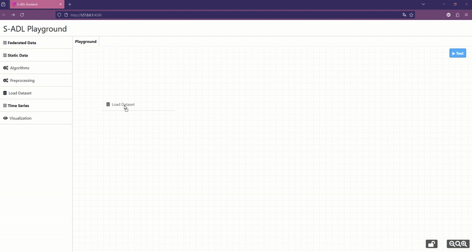
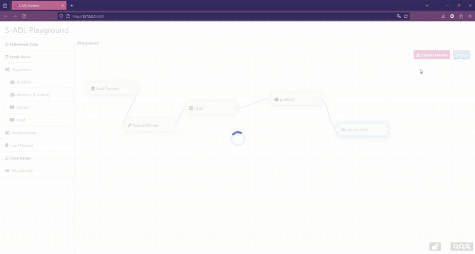
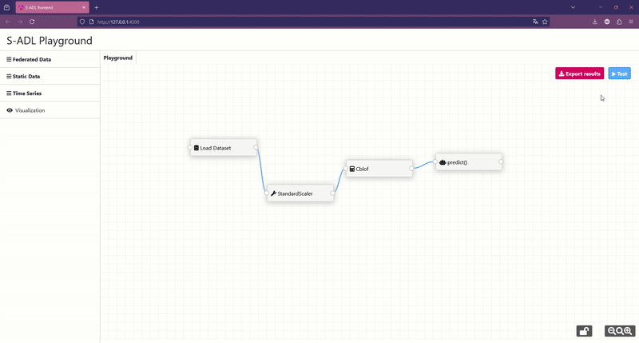

# S-ADL-frontend

This web application enables users to design and run custom data pipelines for anomaly detection, preprocessing, and visualization through a **node-based interface**. Each node represents an algorithm, transformation, or data source (API or scraper), and the results can be visualized, saved, or exported. 

This is a visual interface designed to get to know [**S-ADL library**](https://github.com/ari-dasci/S-ADL), a Software Anomaly Detection Library that provides a modular collection of state-of-the-art algorithms for detecting anomalies in different types of data. S-ADL includes tools for preprocessing, visualization, and state-of-the-art algorithms for detecting anomalies in different types of data.

The system is composed of a **frontend built with Angular** and a **backend REST API built with FastAPI**. The app supports dynamic pipeline execution and modular visualization.

---

## 🧱 Features & How to Use
- 🧠 **Modular Node Editor**: Drag-and-drop interface to design custom pipelines (based on [**Drawflow**](https://github.com/jerosoler/Drawflow)).
  
  

- 📈 **Interactive Visualizations**: Automatically display plots using Plotly.js.

  


- 🧪 **Pipeline Execution**: Run full pipelines with a single button.

  

- 🧾 **Export Results**: Save visualizations as `.txt` files after execution.

  

- 📦 **Backend Algorithm Library**: Easily extend with new processing models.

---

## 🛠️ Technologies

- **Frontend**: Angular 17+, Bootstrap Modals, Plotly.js
- **Backend**: FastAPI, Python 3.9+
- **Communication**: REST API (JSON)
- **Library**: S-ADL Software Anomaly Detection Library 

---

## 🚀 Getting Started

### 1. Clone the repository

```bash
git clone https://github.com/marinahbau/S-ADL-frontend.git
cd S-ADL-frontend
```

---

## 👥 Frontend Setup (Angular)

### Prerequisites

- Angular CLI: 17.3.17
- Node.js: 21.7.1

You can install Angular CLI via:
```bash
npm install -g @angular/cli@17
```

### Install dependencies

```bash
npm install
```

### Run the Angular development server

```bash
ng serve
```

Then open your browser at: [http://localhost:4200](http://localhost:4200)

---

## 🧪 Backend Setup (FastAPI)

### Prerequisites

- **Python: 3.10** (tested with 3.10.18)
- **Pytorch: 2.7.1** (tested with with CUDA 11.8 support)
- `conda` (optional but recommended)


### Clone the frontend repository

```bash
git clone https://github.com/marinahbau/S-ADL-frontend.git
cd S-ADL-frontend
```

### Clone the API (backend) repository

```bash
git clone https://github.com/marinahbau/S-ADL-API.git
```

### Clone the S-ADL library

```bash
git clone https://github.com/marinahbau/S-ADL.git
```

### Install S-ADL library + API (conda environment)


```bash
conda create --prefix ./envs/sadl-env python=3.10.18

conda activate ./envs/sadl-env 

conda env update --prefix /mnt/homeGPU/mbautista/sadl-env --file sadl-env.yml --prune

#Make sure Pytorch is installed now, if you have CUDA 11.8
pip3 install torch torchvision torchaudio --index-url https://download.pytorch.org/whl/cu118

pip install pytorch-lightning
```

Now install the API with

```bash
pip install "fastapi[standard]"
pip install "uvicorn[standard]"
```

Export path to S-ADL library

```bash
export PYTHONPATH=«route_to_SADL»
```

### Run the FastAPI server

```bash
uvicorn main:app --reload --host 0.0.0.0 
```

API will be available at: [http://localhost:8000](http://localhost:8000)

Swagger documentation: [http://localhost:8000/docs](http://localhost:8000/docs)

---

## 📡 Connecting Frontend to Backend

The Angular app is preconfigured to send pipeline requests to `http://localhost:8000`. Make sure the FastAPI server is running **before** executing any pipeline.

---

## 🧪 Running a Pipeline

1. Add nodes to the canvas.
2. Configure their parameters.
3. Click **"Run pipeline"**.
4. Visualizations will appear in modals.
5. After execution, a message with a button will let you **export results as a **`.txt`** file**.

---

## 🧩 Customization

- **To add new algorithms**: Register them in the backend’s pipeline manager.
- **To add new node types**: Define them in the Angular `nodes` configuration.
- **To support new visualizations**: Ensure the backend returns valid Plotly JSON in `visualizations`.

---
